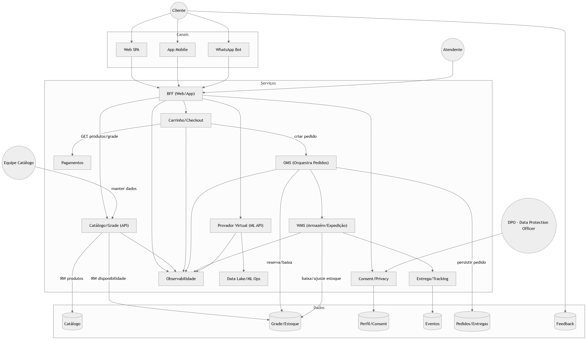

# 6ASOR_RM358494_Arquitetura-da-escolha
# E-Commerce de Moda — Provador Virtual + Checkout de Confiança

> **Resumo**: Reduzir **devoluções** por erro de tamanho e **abandono de carrinho** ao combinar um **Provador Virtual com IA** e um **Checkout de Confiança**.

---

## 📖 Storytelling + Tema
No varejo de moda online, a cliente compra uma peça de roupa sem ter certeza do tamanho.  
Quando o produto chega, percebe que **não serve**. Ela devolve, se frustra e evita comprar novamente na loja.

**Nossa proposta**:  
- **Provador Virtual (IA)** que recomenda tamanho/ajuste.  
- **Checkout de Confiança** que informa **estoque, frete e prazo com clareza**.  
- **Feedback loop** que melhora continuamente o modelo de recomendação.  

---

## 🎯 O que esperamos aprender
1. O impacto do provador em **conversão** e **devoluções**.  
2. Se a **transparência no checkout** reduz abandono.  
3. Se a arquitetura escala em **eventos de alta demanda** (ex.: Black Friday).  
4. Qual o custo-benefício de IA vs. devoluções reduzidas.  

---

## ❓ Perguntas críticas
- Qual a **taxa de acerto** do modelo?  
- O provador reduz devoluções em **≥ 15%**?  
- Transparência de frete reduz abandono?  
- Qual a aceitação dos clientes em compartilhar dados?  
- A arquitetura garante **latência e disponibilidade** em picos?  

---

## ⚠️ Principais riscos
- **Privacidade e LGPD** (imagens e medidas).  
- **Baixa precisão** do modelo ML.  
- **Escalabilidade** em picos de acesso.  
- **Inconsistência de estoque** entre OMS/WMS.  
- **Indisponibilidade** em datas críticas.  

---

## 🧪 Plano de aprendizado
- Construir um **MVP** em 2 categorias de produto.  
- Rodar **teste A/B** (Provador ON vs OFF).  
- Medir: conversão, devolução, abandono, latência.  
- Feedback contínuo → re-treino de modelo.  

---

## 🛡️ Plano de mitigação de riscos
- **Consent/Privacy Service**: coleta e guarda consentimento.  
- **Fallback** no ML: recomendar 2 tamanhos alternativos.  
- **Autoscaling + Event-driven**: suportar picos.  
- **OMS centralizado**: consistência de estoque.  
- **Observabilidade**: logs, métricas e tracing distribuído.  

---

## 👥 Stakeholders
- **Cliente final** → confiança, menos devoluções.  
- **Atendente** → dados para atender rápido.  
- **Equipe de Catálogo** → manter medidas atualizadas.  
- **Logística** → previsibilidade de estoque.  
- **DPO** → conformidade LGPD.  
- **Diretoria** → aumento de margem e NPS.  

---

## 👤 Usuários e objetivos
- **Cliente** → escolher o tamanho certo e receber no prazo.  
- **Atendente** → resolver dúvidas/trocas.  
- **Equipe interna** → manter catálogo e estoque consistentes.  

---

## 💀 Pior cenário
- Vazamento de dados sensíveis.  
- Sistema fora do ar em Black Friday.  
- Estoque inconsistente → overselling e devoluções em massa.  

---

## 🏗️ Arquitetura Freeform (visão inicial)


---

## 🔎 Descrição dos principais componentes
- **SPA Web/App** — interface cliente.  
- **BFF** — orquestra APIs, normaliza eventos, A/B testing.  
- **API Catálogo** — produtos e disponibilidade.  
- **API Provador ML** — recomendação de tamanho via ML.  
- **API Checkout** — carrinho, frete, pedido.  
- **OMS** — orquestra pedidos e estoque.  
- **WMS** — armazém/expedição.  
- **Consent/Privacy** — gestão de consentimento LGPD.  
- **Observabilidade** — métricas, logs, tracing.  
- **Event Bus** — transmissão de eventos.  
- **Data Lake/ML Ops** — treino e feedback dos modelos.  

---

## ✅ Requisitos arquiteturais
1. **LGPD/Privacidade by design** — confiança e conformidade.  
2. **Alta disponibilidade** (≥ 99,9%).  
3. **Baixa latência** (p95 < 400ms).  
4. **Escalabilidade elástica** — suportar picos de 10x.  
5. **Observabilidade ponta a ponta**.  
6. **Idempotência em pagamentos**.  

---

## 🧩 Reflexão sobre os diagramas
- **Freeform**: mostra fluxo inicial e riscos.  
- **C4 Contexto**: visão de atores e integrações externas.  
- **C4 Container**: responsabilidades de APIs, BFF e serviços.  
- **C4 Componente**: detalha o Provador Virtual ML (consentimento, orquestração, workers).  

**Padrões essenciais**: camadas, BFF, event-driven, observabilidade.  
**Padrões ocultos**: CQRS leve, fallback no ML, canary release.  
**Metamodelo**: Atores, Serviços, Armazenamento, Integrações.  

---

## 🗣️ Discussões e decisões
- **Difícil**: centralizar estoque no OMS.  
- **Sob incerteza**: colocar ML direto em produção ou shadow mode.  
- **Sem retorno**: formato de dados de imagens/medidas (contrato inicial).  
- **Discussão chave**: até onde coletar dados sem perder confiança do cliente.  

---

## 📊 Diagramas C4

### Contexto
```plantuml
test
```

